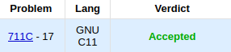
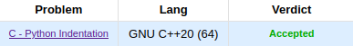
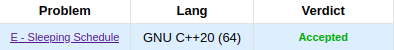

# Programação Dinâmica - Dupla 19

**Número da Lista**: 5 
**Conteúdo da Disciplina**: Programação Dinâmica 
**Apresentação**: 

## Alunos
|Matrícula | Aluno |
| -- | -- |
| 18/0023411  |  Maicon Lucas Mares de Souza |
| 18/0018574  |  Hérya Rodrigues Alcantara |

## Sobre 
Resolução de questões do site CodeForces utilizando Programação Dinâmica.

## Screenshots

### Problema 711C - Coloring Trees

### Problema 909C - Python Indentation

### Problema 1324E -  Sleeping Schedule

## Instalação 
**Linguagem**: C e C++ 

* Acessar o link do problema (indicado no início de cada arquivo de solução);
* Copiar e colar o código da solução na área de submissão;
* Selecionar a linguagem;
* Enviar submissão.

